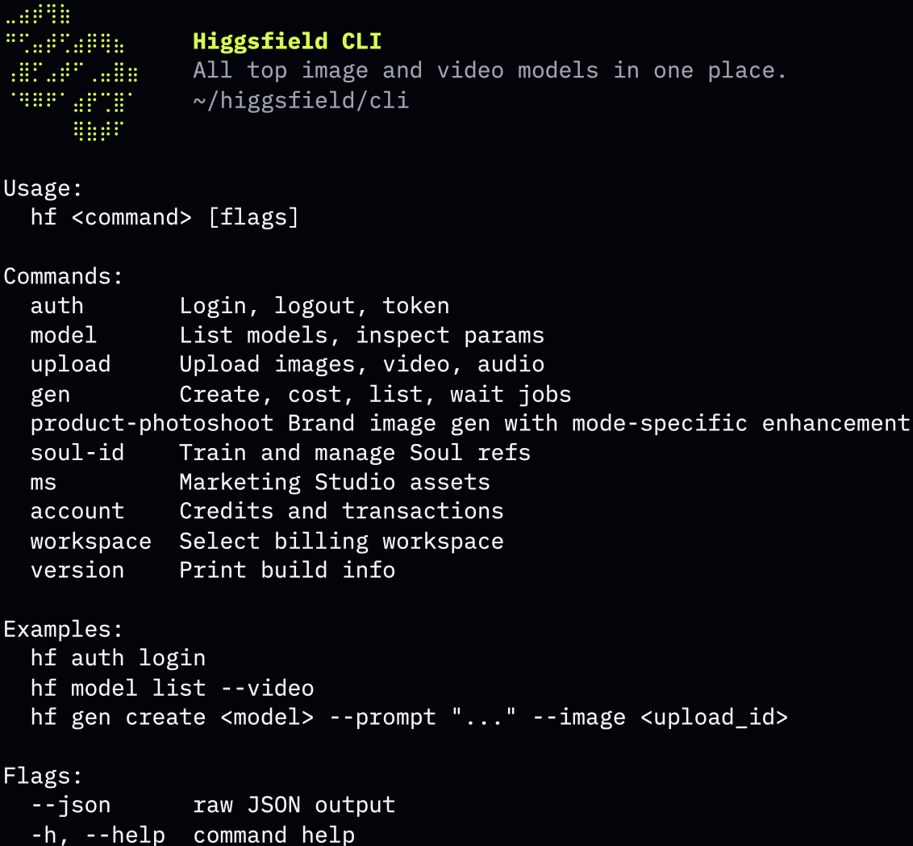

# Higgsfield CLI

[](https://github.com/higgsfield-ai/cli/releases)
[](https://www.npmjs.com/package/@higgsfield/cli)
[](./LICENSE)

Generate images and videos from the terminal using 30+ [Higgsfield AI](https://higgsfield.ai) models — Nano Banana Pro, FLUX.2, Soul V2, Veo 3.1, Kling v3.0, Seedance 2.0, Marketing Studio, and more. Train face-faithful Soul characters and produce branded marketing assets without leaving your shell.



## Contents

- [Install](#install)
- [Quickstart](#quickstart)
- [Examples](#examples)
- [Models](#models)
- [Commands](#commands)
- [Flags](#flags)
- [Updating](#updating)
- [Uninstall](#uninstall)
- [Troubleshooting](#troubleshooting)
- [Support](#support)
- [License](#license)

## Install

### macOS / Linux — curl

```bash
curl -fsSL https://raw.githubusercontent.com/higgsfield-ai/cli/main/install.sh | sh
```

### macOS / Linux — Homebrew

```bash
brew install higgsfield-ai/tap/higgsfield
```

### Cross-platform (incl. Windows) — npm

```bash
npm install -g @higgsfield/cli
```

### Manual

Download an archive matching your OS and architecture from [Releases](https://github.com/higgsfield-ai/cli/releases), extract, and place the binary in your `$PATH`.

## Quickstart

Authenticate:

```bash
higgsfield auth login
```

Generate an image and wait for the result URL:

```bash
higgsfield generate create nano_banana_2 --prompt "a quiet beach at sunrise" --wait
```

## Examples

### Nano Banana Pro

```bash
higgsfield generate create nano_banana_2 \
  --prompt "modern architecture, glass facade, golden hour light" \
  --aspect_ratio 16:9 \
  --resolution 2k \
  --wait
```

### GPT Image 2

```bash
higgsfield generate create gpt_image_2 \
  --prompt "clean infographic showing global energy mix, flat icons, muted palette" \
  --aspect_ratio 3:4 \
  --quality high --resolution 2k \
  --wait
```

### Kling v3.0

```bash
higgsfield generate create kling3_0 \
  --prompt "slow camera push through a forest clearing at dawn" \
  --start-image ./first.png \
  --duration 5 --mode pro \
  --wait
```

### Seedance 2.0

```bash
higgsfield generate create seedance_2_0 \
  --prompt "drone shot over a mountain valley at sunrise" \
  --aspect_ratio 16:9 --duration 5 \
  --resolution 1080p --mode std --genre noir \
  --wait
```

### Soul ID

Train a Soul ID once:

```bash
higgsfield soul-id create --name me --soul-2 \
  --image ./me1.jpg --image ./me2.jpg --image ./me3.jpg
higgsfield soul-id wait <soul_id>
```

Reuse it in any compatible image model:

```bash
higgsfield generate create text2image_soul_v2 \
  --prompt "professional portrait, neutral background, soft daylight" \
  --soul-id <soul_id> \
  --wait
```

## Models

30+ image and video models. Per-model parameters, defaults, and enums: [MODELS.md](./MODELS.md). Live catalog: `higgsfield model list`.

### Image (18)

| job_set_type | name |
|---|---|
| `nano_banana_2` | Nano Banana Pro |
| `nano_banana_flash` | Nano Banana 2 |
| `nano_banana` | Nano Banana |
| `flux_2` | FLUX.2 |
| `flux_kontext` | Flux Kontext |
| `gpt_image_2` | GPT Image 2 |
| `text2image_soul_v2` | Higgsfield Soul V2 |
| `seedream_v4_5` | Seedream 4.5 |
| `seedream_v5_lite` | Seedream V5 Lite |
| `grok_image` | Grok Image |
| `openai_hazel` | OpenAI Hazel |
| `image_auto` | Image Auto |
| `z_image` | Z Image |
| `kling_omni_image` | Kling O1 Image |
| `cinematic_studio_2_5` | Cinematic Studio 2.5 |
| `soul_cinematic` | Soul Cinematic |
| `soul_location` | Soul Location |
| `marketing_studio_image` | Marketing Studio Image |

### Video (16)

| job_set_type | name |
|---|---|
| `veo3_1` | Google Veo 3.1 |
| `veo3_1_lite` | Google Veo 3.1 Lite |
| `veo3` | Google Veo 3 |
| `kling3_0` | Kling v3.0 |
| `kling2_6` | Kling 2.6 Video |
| `seedance_2_0` | Seedance 2.0 |
| `seedance1_5` | Seedance 1.5 Pro |
| `wan2_7` | Wan 2.7 |
| `wan2_6` | Wan 2.6 Video |
| `minimax_hailuo` | Minimax Hailuo |
| `grok_video` | Grok Video |
| `cinematic_studio_3_0` | Cinematic Studio 3.0 |
| `cinematic_studio_video` | Cinematic Studio Video |
| `cinematic_studio_video_v2` | Cinematic Studio Video V2 |
| `soul_cast` | Soul Cast |
| `marketing_studio_video` | Marketing Studio Video |

## Commands

| Command | Purpose |
|---|---|
| `higgsfield auth` | login / logout / inspect token |
| `higgsfield account` | credits balance, transactions |
| `higgsfield workspace` | list / select / unset billing workspace |
| `higgsfield model` | list models, inspect parameter schema |
| `higgsfield generate` | create / cost / wait / get / list jobs |
| `higgsfield upload` | upload an image / video / audio file |
| `higgsfield soul-id` | train and manage Soul characters |
| `higgsfield marketing-studio` | branded ads with avatars and products |
| `higgsfield product-photoshoot` | brand image generation with mode-specific enhancement |
| `higgsfield version` | print build info |

Run `higgsfield <command> --help` for flags and examples (also `higgsfield generate create --help`, `higgsfield soul-id create --help`, etc.).

## Flags

Flags work across all commands.

| Flag | Purpose |
|---|---|
| `--wait` | block until the job finishes; print the result URL |
| `--wait-timeout` | max wait duration (default `10m`) |
| `--wait-interval` | poll interval (default `3s`) |
| `--json` | machine-readable JSON output |
| `--no-color` | disable color output |

Example pipeline:

```bash
higgsfield generate list --json | jq -r '.[] | select(.status=="completed") | .result_url'
```

## Updating

```bash
# curl
curl -fsSL https://raw.githubusercontent.com/higgsfield-ai/cli/main/install.sh | sh

# brew
brew update && brew upgrade higgsfield

# npm
npm install -g @higgsfield/cli@latest
```

Pin to a specific release:

```bash
curl -fsSL https://raw.githubusercontent.com/higgsfield-ai/cli/main/install.sh | sh -s -- --tag v0.1.22
# or
npm install -g @higgsfield/cli@0.1.22
```

## Uninstall

```bash
# curl install (default prefix /usr/local)
sudo rm /usr/local/bin/higgsfield

# brew
brew uninstall higgsfield

# npm
npm uninstall -g @higgsfield/cli
```

## Troubleshooting

**`Session expired` / `Not authenticated`** — tokens are short-lived. Re-run `higgsfield auth login`.

**`Unknown model "<name>"`** — run `higgsfield model list` for the current catalog.

## Support

Bugs and feature requests: [github.com/higgsfield-ai/cli/issues](https://github.com/higgsfield-ai/cli/issues). Please include `higgsfield version` output and the exact command that failed.

## License

[MIT](./LICENSE)
